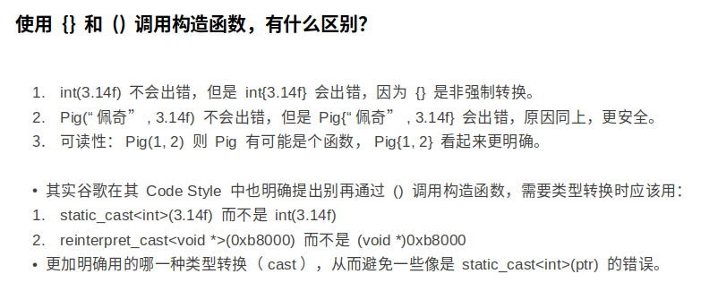
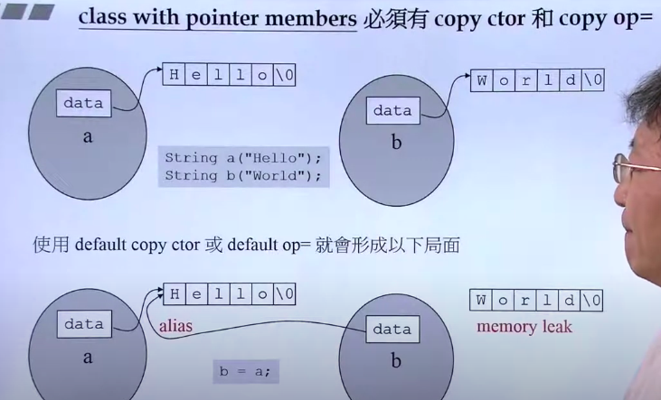
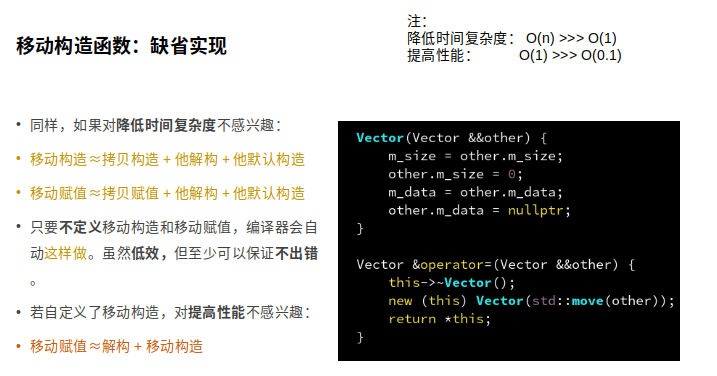
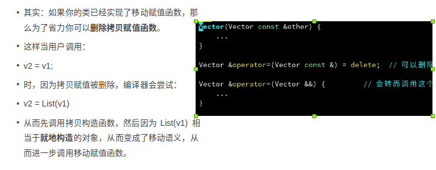
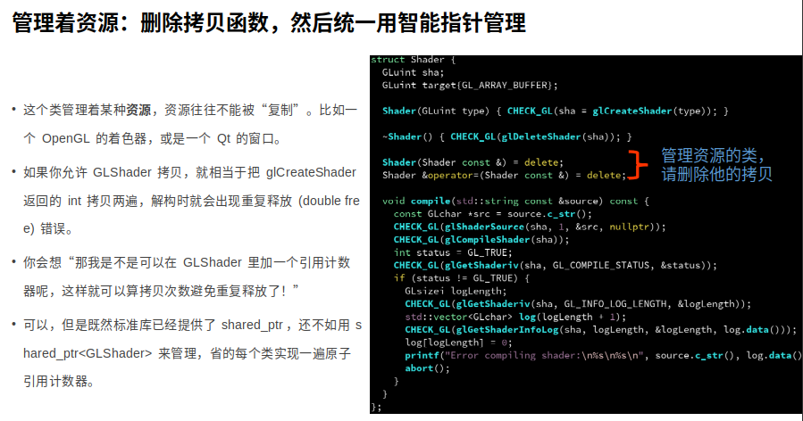

以下为观看[【公开课】第02讲：RAII与智能指针](https://www.bilibili.com/video/BV1LY411H7Gg?spm_id_from=333.999.0.0 笔记) 笔记

### 几个注意点

- C++98 STL	`std::vector<int> v(4);`。

- C++11 引入了 {} 初始化表达式

  ```cpp
  std::vector<int> v = {4, 3, 2, 1};
  ```

- C++11 引入了 range-based for-loop

  ```cpp
  for (int vi : v)
  	sum += vi;
  ```

- for_each 算法模板

  ```cpp
  std::for_each(v.begin(), v.end(), func);
  ```

- C++11 引入了 lambda 表达式

  ```cpp
      std::for_each(v.begin(), v.end(), [&] (int vi) {
          sum += vi;
      });
  ```

- C++14 的 lambda 允许用 auto 自动推断类型

  ```cpp
      std::for_each(v.begin(), v.end(), [&] (auto vi) {
          sum += vi;
      });
  ```

- C++17 CTAD / compile-time argument deduction / 编译期参数推断

  ```cpp
  std::vector v = {4, 3, 2, 1};	// 去掉 int
  ```

  

## RALL

Resource Acquisition Is Initialization。 资源获取视为初始化，反之，资源释放视为销毁。而不再是采用 `malloc` 和 `free `的手动方法。


## 构造函数

### 构造函数初始化表达式

#### 使用方法：

```cpp
struct Pig {
    std::string m_name;
    int m_weight;

    Pig(std::string name, int weight) : m_name(name), m_weight(weight) 		{}
};

int main() {
    Pig pig("aaa", 100);
}
```

[C++ 初始化列表 ](https://www.cnblogs.com/graphics/archive/2010/07/04/1770900.html)

- 初始化类的成员有两种方式，一是使用初始化列表，二是在构造函数体内进行赋值操作。
- 构造函数的执行可以分成两个阶段，初始化阶段和计算阶段，初始化阶段先于计算阶段。

而对于赋值操作，会在初始化阶段**对于需要赋值的对象调用其默认构造函数**。

因此使用初始化列表少了一次调用默认构造函数的过程。

（1）没有默认构造函数的成员类对象；（2）const成员或引用类型的成员。

- 常量成员，因为常量只能初始化不能赋值，所以必须放在初始化列表里面

- 引用类型，引用必须在定义的时候初始化，并且不能重新赋值，所以也要写在初始化列表里面

- 没有默认构造函数的成员类对象，因为使用初始化列表可以不必调用默认构造函数来初始化，而是直接调用拷贝构造函数初始化。

  > ```cpp
  > struct Test1
  > {
  >     Test1(int a):i(a){}
  >     int i ;
  > };
  > 
  > struct Test2
  > {
  >     Test1 test1 ;
  >     Test2(Test1 &t1)
  >     {
  >         test1 = t1 ;
  >     }
  > };
  > ```
  >
  > 以上代码无法通过编译，因为 Test2 类中 Test1 test1; 需要调用默认的构造函数，但是 Test1 类没有无参的构造函数，即 Test1 没有默认的构造函数，故而编译错误。


### 自定义构造函数：单个参数

可以发现当只有一个参数的时候，下面还存在着一种 `Pig pig2 = 80;` 的写法，很难以理解。

```cpp
struct Pig {
    std::string m_name;
    int m_weight;

    Pig(int weight) 
    : m_name("一只 Pig" + std::to_string(weight))
    , m_weight(weight) {}
};

int main() {
    Pig pig(80);
    Pig pig2 = 80;
}
```

可以加上以下 `explicit` 显示定义来限制不能使用 `=` 这种方法。

```cpp
    explicit Pig(int weight) 
    : m_name("一只 Pig" + std::to_string(weight))
    , m_weight(weight) {}
```

因此：请给单参数的构造函数加上 `explicit`。

> **对于多参数**
>
> explicit 的作用体现在禁止从一个 {} 表达式初始化。
>
> 不加的话，其实是可以 `Pig pig1 = {"aaa", 100};` 这样通过`{}`来初始化，但是加上之后便会禁止。




### 编译器默认生成的构造函数

当一个类没有定义任何构造函数，且所有成员都有无参构造函数时，编译器会自动生成一个无参构造函数 Pig()，**他会调用每个成员的无参构造函数**。

#### 初始化某些类型时的问题：

> 但是请注意，这些类型不会被初始化为 0：
>
> - int, float, double 等基础类型
>
> - void *, Object * 等指针类型
>
> - 完全由这些类型组成的类
>
>   这些类型被称为 POD（plain-old-data）。POD 的存在是出于兼容性和性能的考虑。

比如下列 Demo 会打印随机值生成的 `weight`。

```cpp
struct Pig {
    std::string m_name;
    int m_weight;
};

void show(Pig pig) {
    std::cout << "name: " << pig.m_name << std::endl;
    std::cout << "weight: " << pig.m_weight << std::endl;
}

int main() {
    Pig pig;

    show(pig);
    return 0;
}

```

解决办法是 `int m_weight{0};` 或者 `int m_weight = 0;` 进行初始化。

> 顺便一提：
> `int x{};` 、`void *p{};`
> 与
> `int x{0};`、`void *p{nullptr};`等价，都会零初始化。但是不写那个空括号就会变成内存中随机的值。
>
> 再比如：std::cout << int{}; 会打印出 0

#### C++11 会自动生成初始化表达式

他会将 {} 内的内容，会按顺序赋值给对象的每一个成员。但是不支持 `（）`

> 在 C++ 14 后，支持部分初始化。`Pig pig1 = {"佩奇"};`，但是记得保证没有初始化的类成员在定义时进行初始化 `int m_weight{0};` ，以避免随机值。

```cpp
struct Pig {
    std::string m_name;
    int m_weight;
};

void show(Pig pig) {
    std::cout << "name: " << pig.m_name << std::endl;
    std::cout << "weight: " << pig.m_weight << std::endl;
}

int main() {
    Pig pig1 = {"佩奇", 80};   // 编译通过
    Pig pig2{"佩奇", 80};      // 编译通过
    // Pig pig3("佩奇", 80);   // 编译错误！

    show(pig1);
    return 0;
}
```

#### default

如果还想让编译器自动生成默认的无参构造函数，可以用 C++11 新增的这个语法：

```cpp
Pig() = default;
```

如果想要让编译器不要自动生成无参构造函数，可以用 = delete 语法删除：

```cpp
Pig() = delete;
```

> 注：= delete 和 = default 是一对。如果你不确定某个函数有没有被编译器默认生成，可以都用这两个显式地声明一下。


#### 拷贝构造函数

除了无参和初始化列表构造函数外，编译器默认还会生成这样一个特殊的构造函数：

`Pig(Pig const &other);`

可见他的参数是一个 Pig 类型，他的功能就是拷贝 Pig 对象，故称为拷贝构造函数。

> 当然也可以自定义

```cpp
int main() {
    Pig pig1 = {"happy", 70};
    Pig pig = pig1;
    // Pig pig(pig1);
}
```


#### 拷贝赋值函数

除了拷贝构造函数外，编译器默认还会生成这样一个重载 `=` 这个运算符的函数：

```cpp
Pig &operator=(Pig const &other);
```

**拷贝构造函数**的作用是在 Pig **尚未**初始化时，将另一个 Pig 拷贝进来，以初始化当前 Pig 。

```cpp
Pig pig = pig2;  // 拷贝构造
```

**拷贝赋值函数**的作用是在 Pig **已经**初始化后，将当前 Pig 销毁，同时将另一个 Pig 拷贝进来。

```cpp
Pig pig;           // 无参构造
pig = pig2;        // 拷贝赋值
```

追求性能时推荐用拷贝构造，因为可**以避免一次无参构造**，拷贝赋值是出于需要临时修改对象的灵活性需要。

这个函数同样可以由 = delete 和 = default 控制是否默认生成。

> 注：return *this 是为了支持连等号 a = b = c;


#### 必要性 

当 class 存在 class point member 时就必须要有 copy ctor 和 copy op=

如下图可见，default 的都为浅拷贝，而我们需要重写深拷贝。




#### 深浅拷贝

[c++的默认拷贝构造函数，从深度拷贝和浅拷贝说起](https://blog.csdn.net/qq_29344757/article/details/76037255)

默认的**拷贝构造函数**都是浅拷贝，智能指针是浅拷贝

> 小 tip
>
> c++的拷贝构造函数还有一处妙用，就是自定义拷贝构造函数，并设置为 private 属性，其实现体可以什么都不写，那么这个类将变成一个不可被复制的类了。


**拷贝赋值** ～ 解构函数 + 拷贝构造函数

法一：

> 对象的地址就是 this.
>
> `		if (this == &other) {	// 检测自我赋值
>         	return *this;`
>
> 检测自我赋值是针对 `a = a` 的情况，这会导致首先的销毁使两者指向的内容都为空。

可以这样整：（placement new），当然这样会损失性能。

```cpp
    Vector &operator=(Vector const &other) {
		if (this == &other) {	// 检测自我赋值
        	return *this;
        
        this->~Vector();             // 先销毁现有的
        new (this) Vector(other);    // 再重新构造（placement new）
        return *this;                // 支持连等号：v1 = v2 = v3
    }
```

法二：

内存的销毁重新分配可以通过 realloc，从而就地利用当前现有的 m_data，避免重新分配。

```cpp
    Vector &operator=(Vector const &other) {
        m_size = other.m_size;
        m_data = (int *)realloc(m_data, m_size * sizeof(int));
        memcpy(m_data, other.m_data, m_size * sizeof(int));
        return *this;
    }
```


### 移动、swap O(1)

1. **从性能上讲，左右值引用没有区别，传参使用左右值引用都可以避免拷贝。**
2. **右值引用可以直接指向右值，也可以通过std::move指向左值；而左值引用只能指向左值(const左值引用也能指向右值)。**
3. **作为函数形参时，右值引用更灵活。虽然const左值引用也可以做到左右值都接受，但它无法修改，有一定局限性。**

> [一文读懂C++右值引用和std::move](https://zhuanlan.zhihu.com/p/335994370)
>
> **std::move移动不了什么，唯一的功能是把左值强制转化为右值**，让右值引用可以指向左值。其实现等同于一个类型转换：`static_cast<T&&>(lvalue)`。 所以，**单纯的std::move(xxx)不会有性能提升**。
>
> 同样的，右值引用能指向右值，本质上也是把右值提升为一个左值，并定义一个右值引用通过std::move指向该左值：
>
> ```cpp
> int &&ref_a = 5;
> ref_a = 6; 
>  
> 等同于以下代码：
>  
> int temp = 5;
> int &&ref_a = std::move(temp);
> ref_a = 6;
> ```

swap 相当于使用 tmp 临时对象

```cpp
void test_copy() {
    std::vector<int> v1(10);
    std::vector<int> v2(200);

    v1 = v2;                  // 拷贝赋值 O(n)

    std::cout << "after copy:" << std::endl;
    std::cout << "v1 length " << v1.size() << std::endl;  // 200
    std::cout << "v2 length " << v2.size() << std::endl;  // 200
}

void test_move() {
    std::vector<int> v1(10);
    std::vector<int> v2(200);

    v1 = std::move(v2);      // 移动赋值 O(1)

    std::cout << "after move:" << std::endl;
    std::cout << "v1 length " << v1.size() << std::endl;  // 200
    std::cout << "v2 length " << v2.size() << std::endl;  // 0
}

void test_swap() {
    std::vector<int> v1(10);
    std::vector<int> v2(200);

    std::swap(v1, v2);      // 交换两者 O(1)

    std::cout << "after swap:" << std::endl;
    std::cout << "v1 length " << v1.size() << std::endl;  // 200
    std::cout << "v2 length " << v2.size() << std::endl;  // 10
}
```

当然对时间复杂度要求高的，可以进行移动构造函数的自定义。


所谓移动语义，指的就是以移动而非深拷贝的方式初始化含有指针成员的类对象。简单的理解，移动语义指的就是将其他对象（通常是临时对象）拥有的内存资源“移为已用”。

Stashed changes


还存在一个小技巧：如果有移动赋值函数，可以删除拷贝赋值函数




### 五个语句

下面的五个语句，C++认为它们表达的意思是不一样的：

1. `Widget w(w0);`
2. `Widget w = w0`;
3. `Widget w; w = w0`;
4. `Widget w(std::move(w0));`
5. `Widget w; w = std::move(w0);`

语句一和语句二是构造一个Widget，因为w从不存在变成了存在，需要先创建，只不过借助了已有的w0，所以要调用拷贝构造函数`Widget(const Widget & w0);`

语句三是赋值，因为w已经存在，所以只是需要拷贝，不需要创建 。跟语句一和二本质不同。我们要调用拷贝赋值函数，不能调用拷贝构造函数。（那为啥不是移动赋值呢？）

语句四是调用移动构造函数，语句五是调用移动赋值函数。认真品品这些函数的名字，它们的差别很细微。而且写代码的时候除了名字，其他类型信息，一个字符也不能写错，不然你写的就是不一样的函数。移动构造和移动赋值，是跟C++11添加的右值语义相关，而这个又是C++规则多的另外一个表现。

所以上面五个语句调用的对应的函数是

1. `Widget(const Widget& w);`
2. `Widget(const Widget& w);`
3. Widget &`operator=(const Widget& w);`
4. `Widget(Widget&& w);`
5. Widget &`operator=(Widget&&`);


## 内存管理

[简谈 C++ 中指针与引用的底层实现](https://zhuanlan.zhihu.com/p/89175296)

### `unique_ptr` 

std::unique_ptr 是具有专属所有权语义（exclusive ownership semantics）的智能指针，即一个 move-only 类型。（ 即unique_ptr 没有拷贝语义，不可以通过拷贝赋值和构造，但是可以通过移动语义进行资源所有权的转移。）

C++11 引入了 unique_ptr 容器，他的解构函数中会调用 delete p。

```cpp
std::unique_ptr<C> p = std::make_unique<C>();
```

- `p = nullptr` 封装了` delete p 和 p = nullptr`  两个操作。


#### 禁止拷贝

下面语句会出错

```cpp
void func(std::unique_ptr<C> p) {
    p->do_something();
}

int main() {
    std::unique_ptr<C> p = std::make_unique<C>();
    func(p);  // 出错
    return 0;
}
```

**原因还是三五法则，如果拷贝了指针，那么就会出现之前 Vector 那样重复释放（double free）的问题。**

解决办法：

一、获取原始指针。（此法针对于不需要“夺走”资源的占有权（ownership）。）

比如下面这个例子，func() 只是调用了 p 的某个成员函数而已，并没有接过掌管对象生命周期的大权。

```cpp
void func(C *p) {
    p->do_something();
}

int main() {
    std::unique_ptr<C> p = std::make_unique<C>();
    func(p.get());
    return 0;
}
```

二、采用 move 方法。（func() 需要“夺走”资源的占有权） 

比如下面这个例子，func 把指针放到一个全局的列表里，p 的生命周期将会变得和 objlist 一样长。因此需要接过掌管对象生命周期的大权。

```cpp
std::vector<std::unique_ptr<C>> objlist;

void func(std::unique_ptr<C> p) {
    objlist.push_back(std::move(p));  // 进一步移动到 objlist
}

int main() {
    std::unique_ptr<C> p = std::make_unique<C>();
    printf("移交前：%p\n", p.get());  // 不为 null
    func(std::move(p));    // 通过移动构造函数，转移指针控制权
    printf("移交后：%p\n", p.get());  // null，因为移动会清除原对象
    return 0;
}
```


对于法二，又存在这样一个问题：当进行 move 之后，此时就不能再访问到 `p` 这个已经释放了的对象。

| p.get() | 返回P中保存的指针，要小心使用，若智能指针释放了其对象，返回的指针所指向的对象也就消失了 |
| ------- | ------------------------------------------------------------ |

解决办法是：shared_ptr

### `shared_ptr`

使用起来很困难的原因，在于 unique_ptr **解决重复释放的方式**是禁止拷贝，这样虽然有效率高的优势，但导致使用困难，容易犯错等。

相比之下， 牺牲效率换来自由度的 shared_ptr 则允许拷贝，他**解决重复释放的方式是通过引用计数：**

- 当一个 shared_ptr 初始化时，将计数器设为 1。

- 当一个 shared_ptr 被拷贝时，计数器加 1。

- 当一个 shared_ptr 被解构时，计数器减 1。减到0时，则自动销毁他指向的对象。

  从而可以保证，只要还有存在哪怕一个指针指向该对象，就不会被解构。

```cpp
int main() {
    std::shared_ptr<C> p = std::make_shared<C>(); // 引用计数初始化为1

    printf("use count = %ld\n", p.use_count());   // 1

    func(p);  // shared_ptr 允许拷贝！和当前指针共享所有权，引用计数加1

    printf("use count = %ld\n", p.use_count());   // 2

    func(p);  // 多次也没问题~ 多个 shared_ptr 会共享所有权，引用计数加1

    printf("use count = %ld\n", p.use_count());   // 3

    p->do_something();  // 正常执行，p 指向的地址本来就没有改变

    objlist.clear();    // 刚刚 p 移交给 func 的生命周期结束了！引用计数减2

    printf("use count = %ld\n", p.use_count());   // 1

    p->do_something();  // 正常执行，因为引用计数还剩1，不会被释放

    return 0;  // 到这里最后一个引用 p 也被释放，p 指向的对象才终于释放
}
```

可以通过 `use_count` 函数获取当前指针的引用计数。

现在的问题是：内存占用高、引用计数的增减原子操作成本高、循环引用等。

### `weak_ptr`

解决循环引用的办法是：把其中逻辑上“不具有所属权”的那一个改成 weak_ptr 即可

譬如对于以下代码。因为父窗口“拥有”子窗口是天经地义的，而子窗口并不“拥有”父窗口。我们希望子窗口的删除不影响到父窗口。

```cpp
struct C {
    std::shared_ptr<C> m_child;
    std::shared_ptr<C> m_parent;	// -> weak_ptr
};

int main() {
    auto parent = std::make_shared<C>();
    auto child = std::make_shared<C>();		

    // 建立相互引用：
    parent->m_child = child;
    child->m_parent = parent;

    parent = nullptr;  // parent 不会被释放！因为 child 还指向他！
    child = nullptr;   // child 也不会被释放！因为 parent 还指向他！

    return 0;
}
```

有时候我们希望维护一个 shared_ptr 的弱引用 weak_ptr，即：弱引用的拷贝与解构不影响其引用计数器。

之后有需要时，可以通过 lock() 随时产生一个新的 shared_ptr 作为强引用。但不 lock 的时候不影响计数。如果失效（计数器归零）则 expired() 会返回 false，且 lock() 也会返回 nullptr。

```cpp
int main() {
    std::shared_ptr<C> p = std::make_shared<C>(); // 引用计数初始化为1

    printf("use count = %ld\n", p.use_count());   // 1

    std::weak_ptr<C> weak_p = p;        // 创建一个不影响计数器的弱引用

    printf("use count = %ld\n", p.use_count());   // 1

    func(std::move(p));  // 控制权转移，p 变为 null，引用计数加不变

    if (weak_p.expired())		// expired 判断是否失效
        printf("错误：弱引用已失效！");
    else
        weak_p.lock()->do_something();  // 正常执行，p 的生命周期仍被 objlist 延续着

    objlist.clear();    // 刚刚 p 移交给 func 的生命周期结束了！引用计数减1，变成0了

    if (weak_p.expired())              // 因为 shared_ptr 指向的对象已释放，弱引用会失效
        printf("错误：弱引用已失效！");
    else
        weak_p.lock()->do_something();  // 不会执行

    return 0;  // 到这里最后一个弱引用 weak_p 也被释放，他指向的“管理块”被释放
}

```


### 当智能指针作为类的成员变量时

可以在类中使用智能指针作为成员变量。需要根据实际情况（主要是看所有权），判断要用哪一种智能指针：

>  shared_ptr 和 weak_ptr 一起用，unique_ptr 和 原始指针一起用。
>
> 在 cpp 中只有 shared_ptr 和 weak_ptr 是浅拷贝，其他都是深拷贝。

- unique_ptr：当该对象仅仅属于我时。比如：父窗口中指向子窗口的指针（归属）。
- 原始指针：当该对象不属于我，但他释放前我必然被释放时。有一定风险。比如：子窗口中指向父窗口的指针。（空悬指针）
- shared_ptr：当该对象由多个对象共享时，或虽然该对象仅仅属于我，但有使用 weak_ptr 的需要。
- weak_ptr：当该对象不属于我，且他释放后我仍可能不被释放时。比如：指向窗口中上一次被点击的元素。
  初学者可以多用 shared_ptr 和 weak_ptr 的组合，更安全。

```cpp
struct C {
    // 当一个类具有 unique_ptr 作为成员变量时：
    std::unique_ptr<D> m_pD;

    // 拷贝构造/赋值函数会被隐式地删除：
    // C(C const &) = delete;
    // C &operator=(C const &) = delete;

    // 移动构造/赋值函数不受影响：
    // C(C &&) = default;
    // C &operator=(C &&) = default;
};
```


## 三五法则

在 C++98 中，由于没有移动语义的存在，所以我们只会定义 3 个成员函数来控制对象在销毁、拷⻉和赋值时做什么操作，这些函数分别为析构函数、拷⻉构造函数和拷⻉赋值函数。此时的拷⻉控制称之为 C++ 三法则；
而在 C++11 中，额外的添加了移动语义，使得程序可以通过**转移对象控制权**的方式实现对象的移动，也就是**移动构造函数和移动赋值函数**。加上这两个函数以后，能够影响对象拷⻉控制的函数增加至 5 个所以也称之为 C++ 五法则；
后面为了统一，干脆称为“三/五法则”，指的其实就是析构函数，拷⻉构造函数，拷⻉赋值函数，移动构造函数以及移动赋值函数。

```cpp
一般来说，可以认为符合三五法则的类型是安全的。
以下类型是安全的：
int id;							// 基础类型
std::vector<int> arr;			// STL 容器
std::shared_ptr<Object> child;  // 智能指针
Object *parent;					// 原始指针，如果是从智能指针里 .get() 出来的
以下对象是不安全的：
char *ptr;			// 原始指针，如果是通过 malloc/free 或 new/delete 分配的
GLint tex;			// 是基础类型 int，但是对应着某种资源
std::vector<Object *> objs;       // STL 容器，但存了不安全的对象
```

如果你的类所有成员，都是安全的类型，那么五大函数都无需声明（或声明为 = default），你的类自动就是安全的。
最好的判断方式是：如果你**不需要自定义的解构函数**，那么这个类就不需要担心。因为如果用到了自定义解构函数，往往意味着你的类成员中，包含有不安全的类型。

一般无外乎两种情况：

- 你的类管理着资源。
- 你的类是数据结构。

### 类管理着资源




### 数据结构

注意到，如果函数的参数声明为值类型，很可能会造成一次不必要的拷贝。


### 函数参数

注意到，如果函数的参数声明为值类型，很可能会造成一次不必要的拷贝：

举个栗子：

下面代码中的 `show(Pig &pig)` 会隐式的进行拷贝。

```cpp
struct Pig {
    std::string m_name;
    int m_weight;

    Pig(std::string name, int weight)
        : m_name(name)
        , m_weight(weight)
    {}

    Pig(Pig const &other)
        : m_name(other.m_name)
        , m_weight(other.m_weight)
    {
        std::cout << "拷贝了一只猪！" << std::endl;
    }
};

void show(Pig &pig) {
    std::cout << "name: " << pig.m_name << std::endl;
    std::cout << "weight: " << pig.m_weight << std::endl;
}

int main() {
    Pig pig{"佩奇", 80};
    show(pig);
    return 0;
}
```

因此解决办法可以为：

`show(Pig const &pig)`，即这样传递的就是 **pig 对象的常引用**，从而实际只传递了一个指针，避免了拷贝。

> 我们可以**将拷贝构造函数声明为 explicit 的，这样隐式的拷贝就会出错**，从而发现因为疏忽大意造成的不必要拷贝。而当的确需要拷贝时，也可以改成 Pig(pig) 语法来强制拷贝。
>
> ```cpp
> struct Pig {
>     std::string m_name;
>     int m_weight;
> 
>     Pig(std::string name, int weight)
>         : m_name(name)
>         , m_weight(weight)
>     {}
> 
>     explicit Pig(Pig const &other) = default;
> };
> 
> void show(Pig pig) {
>     std::cout << "name: " << pig.m_name << std::endl;
>     std::cout << "weight: " << pig.m_weight << std::endl;
> }
> 
> int main() {
>     Pig pig{"佩奇", 80};
>     show(pig);       // 编译错误
>     show(Pig{pig});  // 编译通过
>     return 0;
> }
> ```
>
> 


#### 函数参数类型优化规则：按引用还是按值？

- 如果是基础类型（比如 int，float）则按值传递：
  float squareRoot(float val);
- 如果是原始指针（比如 int *，Object *）则按值传递：
  void doSomethingWith(Object *ptr);
- 如果是数据容器类型（比如 vector，string）则**按常引用传递**： 
  int sumArray(std::vector<int> const &arr);
- 如果数据容器不大（比如 tuple<int, int>），则其实可以按值传递：
  glm::vec3 calculateGravityAt(glm::vec3 pos);
- 如果是智能指针（比如 shared_ptr），且**需要生命周期控制权**，则按值传递：
  void addObject(std::shared_ptr<Object> obj);
- 如果是智能指针，但**不需要生命周期**，则通过 .get() 获取原始指针后，按值传递：
  void modifyObject(Object *obj);


