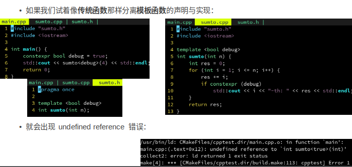

## 模板函数

一些资料

[C++ Template 进阶指南](https://github.com/wuye9036/CppTemplateTutorial)


### 模板泛化

分为 类模板, 函数模板, 成员模板

### template Class

我们把通过类型绑定将模板类变成“普通的类”的过程，称之为模板实例化（Template Instantiate）。实例化的语法是：

```
模板名 < 模板实参1 [，模板实参2，...] >
```


#### 特化 Specialization

> 也称为 Full Specialization

```cpp
template<>
class allocator<void> {
public:
  typedef size_t      size_type;
  typedef ptrdiff_t   difference_type;
  typedef void*       pointer;
  typedef const void* const_pointer;
  typedef void        value_type;

  template <class _Tp1> struct rebind {
    typedef allocator<_Tp1> other;
  };
};

// Specialization
template<>
class allocator<int> {
	...
}
```

如果现在使用 `allocator<Foo>` 那么会进入到泛化模板中，void 和 int 都是会进入到特化中。 

**即：当模板实例化时提供的模板参数不能匹配到任何的特化形式的时候，它就会去匹配类模板的“原型”形式。**

> 出现 **此处的 `template<>`**这种格式的解释如下：
>
> ```cpp
> 
> // 我们这个模板的基本形式是什么？
> template <typename T> class allocator;
> 
> // 但是这个类，是给T是Int的时候用的，于是我们写作
> class allocator<int>;
> // 当然，这里编译是通不过的。
> 
> // 但是它又不是个普通类，而是类模板的一个特化（特例）。
> // 所以前面要加模板关键字template，
> // 以及模板参数列表
> template </* 这里要填什么？ */> class AddFloatOrMulInt<int>;
> 
> // 最后，模板参数列表里面填什么？因为原型的T已经被int取代了。所以这里就不能也不需要放任何额外的参数了。
> // 所以这里放空。
> template <> class AddFloatOrMulInt<int>
> {
>     // ... 针对Int的实现 ... 
> };
> 
> // Bingo!
> ```
>
> 注：STL 中的 `__STL_TEMPLATE_NULL` 类似 `template<>` 表示要开始特化了.


并且由于可以使用 T* 作为特化，因此是以下写法：

```cpp
template <typename T>
class RemovePointer
{
public:
    typedef T Result;  // 如果放进来的不是一个指针，那么它就是我们要的结果。
};

template <typename T>	// 此处需要 T
class RemovePointer<T*>	// 祖传牛皮藓，专治各类指针
{
public:
    typedef T Result;  // 去掉一层指针，把 T* 这里的 T 取出来。
};

void Foo()
{
    RemovePointer<float*>::Result x = 5.0f; // 喏，用RemovePointer后，那个Result就是把float*的指针处理掉以后的结果：float啦。
    std::cout << x << std::endl;
}
```

因此利用这个特性，可以：把指针类型的那个指针给“干掉”：

再进一步：如果传进来的是类似 `RemovePointer<int**>` 这样的东西呢？是的没错，去掉一层之后还是一个指针，因此继续向下取就行。

```cpp
template <typename T>
class RemovePointer<T*>
{
public:
    // 如果是传进来的是一个指针，我们就剥夺一层，直到指针形式不存在为止。
    // 例如 RemovePointer<int**>，Result 是 RemovePointer<int*>::Result，
    // 而 RemovePointer<int*>::Result 又是 int，最终就变成了我们想要的 int，其它也是类似。
    typedef typename RemovePointer<T>::Result Result;
};
```


#### 还存在 偏特化 Partial Specialization

泛化

```cpp
template <class T, class Alloc = alloc>  // 缺省使用 
class vector {
	...
};
```

偏特化_1(此偏特化指的是泛化变量的局部特化)

```cpp
template <class Alloc> 
class vector<bool, Alloc> {
	...
};
```

泛化

```cpp
template <class T> 
class vector {
	T ...
};
```

偏特化_2(此偏特化指的是泛化变量为指针, 缩小了泛化变量的范围, 因此也是一种偏特化)

```cpp
template <class T> 
class vector<T*> {
	T ...
};
```


### template Function

模板函数的语法与模板类基本相同，也是以关键字`template`和模板参数列表作为声明与定义的开始。

```cpp
template <typename T> void foo(T const& v);
template <typename T> T foo();
template <typename T, typename U> U foo(T const&);
template <typename T> void foo() { T var; } 
```

C++ 支持推导一部分模板参数，**但需要先写指定的模板参数，再把能推导出来的模板参数放在后面**。

其中有一点需要注意，因为模板的匹配是在编译的时候完成的，所以实例化模板的时候所使用的参数，也必须要在编译期就能确定。例如以下的例子编译器就会报错：

```cpp
template <int i> class A {};

void foo()
{
    int x = 3;
    A<5> a; // 正确！
    A<x> b; // error C2971: '_1_3::A' : template parameter 'i' : 'x' : a local variable cannot be used as a non-type argument
}
```


#### 整型也可是Template参数

模板参数除了类型外（包括基本类型、结构、类类型等），也可以是一个整型数（Integral Number）。**这里的整型数比较宽泛，包括布尔型，不同位数、有无符号的整型，甚至包括指针**。我们将整型的模板参数和类型作为模板参数来做一个对比：

```cpp
template <typename T = int> class TemplateWithType;	// 可以有默认参数
template <int      V> class TemplateWithValue;
```

可看出 `typename` 的意思：它相当于是模板参数的“类型”，告诉你 `T` 是一个 `typename`。

**整型模板参数最基本的用途，就是定义一个常数。**

```cpp
template <int i> class A 
{
public:
    void foo(int) {}
};
template <uint8_t a, typename b, void* c> class B {};
template <bool, void (*a)()> class C {};
template <void (A<3>::*a)(int)> class D {};
template <int i> int Add(int a)	// 当然也能用于函数模板
{
    return a + i;
}

void foo()
{
    A<5> a;
    B<7, A<5>, nullptr>	b; // 模板参数可以是一个无符号八位整数，可以是模板生成的类；可以是一个指针。
    C<false, &foo> c;      // 模板参数可以是一个bool类型的常量，甚至可以是一个函数指针。
    D<&A<3>::foo> d;       // 丧心病狂啊！它还能是一个成员函数指针！
    int x = Add<3>(5);     // x == 8。因为整型模板参数无法从函数参数获得，所以只能是手工指定啦。
}
```

当然也可以和 class 一起使用，会进行推断。

> 为什么要支持整数作为模板参数？因为是编译期常量
>
> template <int N> 传入的 N，是一个编译期常量，每个不同的 N，编译器都会单独生成一份代码，从而可以对他做单独的优化。
> 而 func(int N)，则变成运行期常量，编译器无法自动优化，只能运行时根据被调用参数 N 的不同。
> **比如 show_times<0>() 编译器就可以自动优化为一个空函数**。因此模板元编程对高性能编程很重要。
> 通常来说，模板的内部实现需要被暴露出来，除非使用特殊的手段，否则，定义和实现都必须放在头文件里。
> 但也正因如此，如果过度使用模板，会导致生成的二进制文件大小剧增，编译变得很慢等。

```cpp
template <int N = 1, class T>
void show_times(T msg) {
    for (int i = 0; i < N; i++) {
        std::cout << msg << std::endl;
    }
}

int main() {
    show_times("one");
    show_times<3>(42);
    show_times<4>('%');
}
```


与特化类似，可以使用函数重载来调用特定的函数。

```cpp
template <class T>
T twice(T t) {
    return t * 2;
}

std::string twice(std::string t) {
    return t + t;
}
```

但存在一个问题，那就是如果我用 `twice(“hello”)` 这样去调用，他不会自动隐式转换到 std::string 并调用那个特化函数，而是会去调用模板函数 twice<char *>(“hello”)，从而出错。
可能的解决方案：SFINAE（Substitution failure is not an error ）。

> std/boost库中的 `enable_if` 是 SFINAE 最直接也是最主要的应用。


### 模板的应用

#### 编译期优化案例

在右边这个案例中，我们声明了一个 sumto 函数，作用是求出从 1 到 n 所有数字的和。
用一个 debug 参数控制是否输出调试信息。

```cpp
int sumto(int n, bool debug) {
    int res = 0;
    for (int i = 1; i <= n; i++) {
        res += i;
        if (debug)			// <-------- 此处
            std::cout << i << "-th: " << res << std::endl;
    }
    return res;
}

int main() {
    std::cout << sumto(4, true) << std::endl;
    std::cout << sumto(4, false) << std::endl;
    return 0;
}
```

但是这样 debug 是**运行时判断**，这样即使是 debug 为 false 也会浪费 CPU 时间。即还是会存在个分支判断。

因此可以把 debug 改成模板参数，这样就是**编译期常量**。编译器会生成两份函数 sumto<true> 和 sumto<false>。前者保留了调试用的打印语句，后者则完全为性能优化而可以去掉打印语句。

```cpp
template <bool debug>
int sumto(int n) {
    int res = 0;
    for (int i = 1; i <= n; i++) {
        res += i;
        if (debug)
            std::cout << i << "-th: " << res << std::endl;
    }
    return res;
}

int main() {
    std::cout << sumto<true>(4) << std::endl;
    std::cout << sumto<false>(4) << std::endl;
    return 0;
}
```

后者其实在编译器看来就是 `if (false) std::cout << ...` 这样显然是会被他自动优化掉的。

> 可以使用 [constexpr](https://zh.wikipedia.org/wiki/Constexpr) 来得到编译期函数和常量等
>
> [C++11/14 constexpr 用法](https://www.jianshu.com/p/34a2a79ea947)
>
> 比如可以：`constexpr` 强调 `debug` 变量为编译期常量，且强调 `isnegative` 为编译期函数。
>
> ```cpp
> template <bool debug>
> int sumto(int n) {
>     int res = 0;
>     for (int i = 1; i <= n; i++) {
>         res += i;
>         if constexpr (debug)
>             std::cout << i << "-th: " << res << std::endl;
>     }
>     return res;
> }
> 
> constexpr bool isnegative(int n) {
>     return n < 0;
> }
> 
> int main() {
>     constexpr bool debug = isnegative(-2014);
>     std::cout << sumto<debug>(4) << std::endl;
>     return 0;
> }
> ```


#### 模板的惰性



这是因为编译器对模板的编译是惰性的，即**只有当前 .cpp 文件用到了这个模板，该模板里的函数才会被定义。**而我们的 sumto.cpp 中没有用到 sumto<> 函数的任何一份定义，所以 main.cpp 里只看到 sumto<> 函数的两份声明，从而出错。

> 解决：在看得见 sumto<> 定义的 sumto.cpp 里，增加两个显式编译模板的声明：
>
> ```cpp
> template int sumto<true>(int n);
> template int sumto<false>(int n);
> ```

一般来说，会建议模板不要分离声明和定义，直接写在头文件里即可。如果分离还要**罗列出所有模板参数**的排列组合，违背了开-闭原则。

> 因此运用这个规则，又可以整花活：
>
> ```cpp
> template <class T = void>
> void func_that_never_pass_compile() {
>     "字符串" = 2333;
> }
> ```
>
> 即实现一个假模板 `<class T = void>` ，这样由于编译惰性，此函数是不会被编译的。只有 `main` 调用之后，才会被编译。
>
> 用一个假模板实现延迟编译的技术，可以加快编译的速度，用于代理模式等。


## auto 自动类型推导

没有 auto 的话，需要声明一个变量，必须重复一遍他的类型，非常麻烦：

因此 C++11 引入了 auto，使用 auto 定义的变量，其类型会自动根据等号右边的值来确定：

```cpp
    auto p = std::make_shared<MyClassWithVeryLongName>();
    std::shared_ptr<MyClassWithVeryLongName> long_name = std::make_shared<MyClassWithVeryLongName>();
```

> - 不能单独声明
>
> ```cpp
> auto p;
> p = std::make_shared<MyClassWithVeryLongName>();
> ```
>
> - 不能用在类成员中。
>
> - 可以用作函数的返回类型：
>
>   使用 auto 以后，**会自动被推导为 return 右边的类型**。
>   不过也有三点注意事项：
>
>   - 当函数有多条 return 语句时，所有语句的返回类型必须一致，否则 auto 会报错。
>   - 当函数没有 return 语句时，auto 会被推导为 void。
>   - 如果声明和实现分离了，则不能声明为 auto。比如：auto func(); // 错误
>
> - auto 也可以定义引用。
>
>   ```cpp
>   int x = 100;
>   auto &ref = x;
>   ```
>
> - 

### 左右值引用

读读此文：[一文读懂C++右值引用和std::move](https://zhuanlan.zhihu.com/p/335994370)

1. 从性能上讲，左右值引用没有区别，传参使用左右值引用都可以避免拷贝。
2. 右值引用可以直接指向右值，也可以通过std::move指向左值；而左值引用只能指向左值(const左值引用也能指向右值)。
3. 作为函数形参时，右值引用更灵活。虽然const左值引用也可以做到左右值都接受，但它无法修改，有一定局限性。

> 可以通过 decltype(变量名) 获取变量定义时候的类型。
>
> 值得注意的是：`decltype((a))`中 `((a))` 被编译器理解为表达式，看做引用。
>
> ```cpp
> decltype(a);    // int
> decltype((a));  // int &
> ```
>
> 可以使用一个 `is_same` 进行 `type_traits` 进行参数是否相同判断。
>
> ```cpp
> std::cout << std::is_same<int const, const int>::value;
> ```

`decltype(auto)` 会自动推导为 func() 的返回类型。

以下两者的区别是：如果 `func` 为 `int& func()` 那么 `auto p` 会报错。而`decltype(auto) p = func();` 相当于 `decltype(func()) p = func();` 会通过。

```cpp
decltype(auto) p = func();
auto p = func();
```

 


### `using` 

typedef A B，使用using B=A可以进行同样的操作。

```cpp
typedef vector<int> V1; 
using V2 = vector<int>;
```

