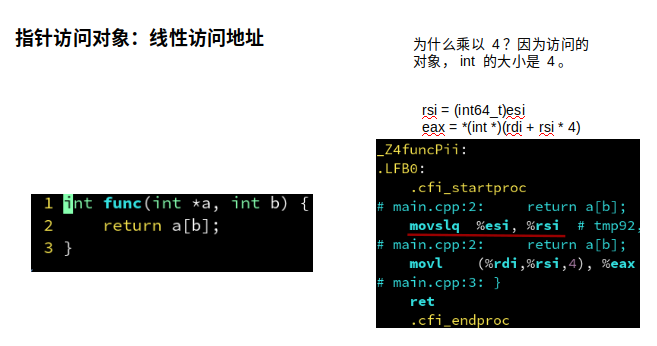
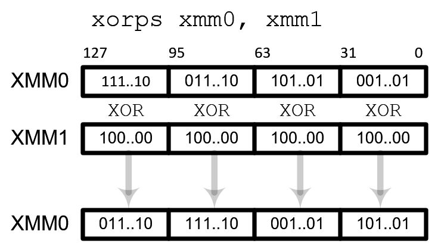
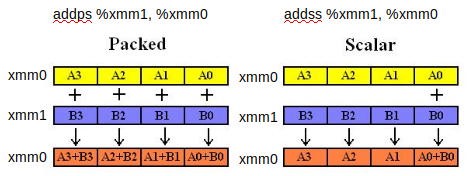
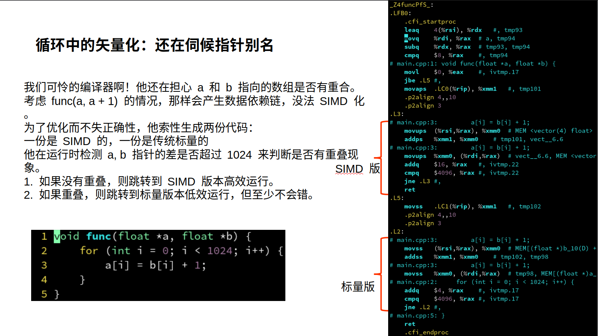
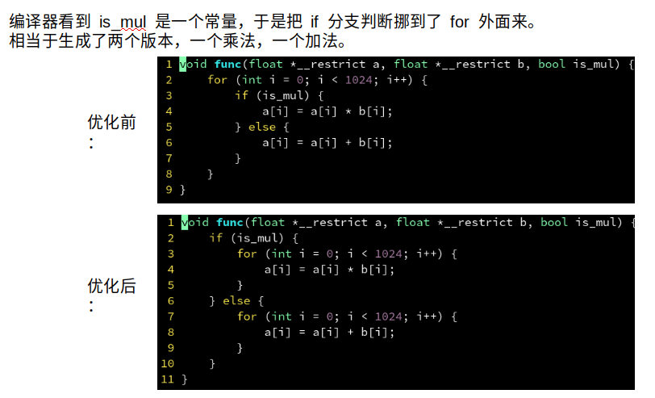
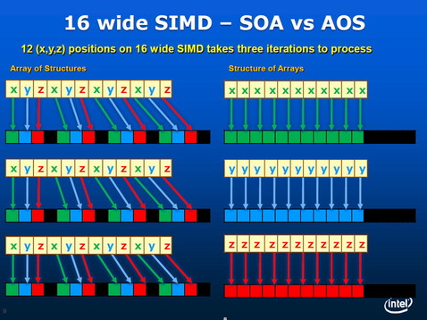

编译参数

```shell
gcc -fomit-frame-pointer -fverbose-asm -S main.cpp -o /tmp/main.S
vim /tmp/main.S
```

`-fomit-frame-pointer`：让生成代码更简洁

`-fverbose-asm` 在编译成汇编语言时，把C变量的名称作为汇编语言中的注释


## 编译器级别的优化

### 指针的索引：尽量用 size_t

size_t 在 64 位系统上相当于 uint64_t
size_t 在 32 位系统上相当于 uint32_t
从而不需要用 movslq 从 32 位符号扩展到 64 位，更高效。而且也能处理数组大小超过 INT_MAX 的情况，推荐始终用 size_t 表示数组大小和索引。

由下图可以看到首先进行了 movslq 从 32 位符号扩展到 64 位。




### 浮点数

#### xmm

浮点作为参数和返回：**xmm 系列寄存器**

```asm
float func(float a, float b) {
    return a + b;
}

# 以下为汇编
#---------------------------

_Z4funcff:
.LFB0:
	.cfi_startproc
# main.cpp:2:     return a + b;
	addss	%xmm1, %xmm0	# b, tmp90
# main.cpp:3: }
	ret
	.cfi_endproc
```

xmm 寄存器有 128 位宽。
可以容纳 4 个 float，或 2 个 double。比如上面代码就只用到了 xmm 的低 32 位用于存储 1 个 float。



#### addss

可以拆分成三个部分：add，s，s
add 表示执行加法操作。
第一个 s 表示标量(scalar)，只对 xmm 的最低位进行运算；也可以是 p 表示矢量(packed)，一次对 xmm 中所有位进行运算。
第二个 s 表示单精度浮点数(single)，即 float 类型；也可以是 d 表示双精度浮点数(double)，即 double 类型。

> addss：一个 float 加法。
> addsd：一个 double 加法。
> addps：四个 float 加法。
> addpd：两个 double 加法。



因此引出 SIMD 。这种单个指令处理多个数据的技术称为 SIMD（single-instruction multiple-data）。他可以大大增加计算密集型程序的吞吐量。

#### SIMD

这种单个指令处理多个数据的技术称为 SIMD（single-instruction multiple-data）。
他可以大大增加计算密集型程序的吞吐量。
因为 SIMD 把 4 个 float 打包到一个 xmm 寄存器里同时运算，很像数学中矢量的逐元素加法。因此 SIMD 又被称为矢量，而原始的一次只能处理 1 个 float 的方式，则称为标量。
在一定条件下，编译器能够把一个处理标量 float 的代码，转换成一个利用 SIMD 指令的，处理矢量 float 的代码，从而增强你程序的吞吐能力！
通常认为利用同时处理 4 个 float 的 SIMD 指令可以加速 4 倍。但是如果你的算法不适合 SIMD ，则可能加速达不到 4 倍；也有因为 SIMD 让访问内存更有规律，节约了指令解码和指令缓存的压力等原因，出现加速超过 4 倍的情况。


### PLT

@PLT 是 Procedure Linkage Table 的缩写，即函数链接表。链接器会查找其他 .o 文件中是否定义了 _Z5otheri 这个符号，如果定义了则把这个 @PLT 替换为他的地址。

定义在同一个文件中的函数就不会有 PLT 这个符号。

因为 static 声明表示不会暴露 other 给其他文件，而且 func 也已经内联了 other，所以编译器干脆不定义 other 了。

inline 关键字？不需要！

在现代编译器的高强度优化下，加不加 inline 无所谓。
编译器不是傻子，**只要他看得见 other 的函数体定义，就会自动内联**，内联与否和 inline 没关系，内联与否只取决于是否在同文件，且函数体够小。
要性能的，定义在头文件声明为 static 即可，没必要加 inline 的
static 纯粹是为了避免多个 .cpp 引用同一个头文件造成冲突，并不是必须 static 才内联
如果你不确定某修改是否能提升性能，那你最好实际测一下，不要脑内模拟
inline 在现代 C++ 中有其他含义，但和内联没有关系，他是一个迷惑性的名字


### SIMD加速

编译器会默认改为 `memset`

```cpp
void func(int *a, int n) {
    for (int i = 0; i < n; i++) {
        a[i] = 0;
    }
}
```

而对于从 0 到 1024 填充：会进行 SIMD 加速

```cpp
void func(int *a) {
    for (int i = 0; i < 1024; i++) {
        a[i] = i;
    }
}
```

通过查看汇编发现类似如下伪代码：

```cpp
void func(int *a) {
    __m128i curr = {0, 1, 2, 3};
    __m128i delta = {4, 4, 4, 4};
    for (int i = 0; i < 1024; i += 4) {
        a[i : i + 4] = curr;
        curr += delta;
    }
}
```

现在问题是：对于不是 4 的倍数的，譬如 1023 的会造成但这样有个缺点，那就是数组的大小必须为 4 的整数倍，否则就会写入越界的地址！

采用的方案是：边界特判。

假设 n = 1023：先对前 1020 个元素用 SIMD 指令填入，每次处理 4 个，剩下 3 个元素用传统的标量方式填入，每次处理 1 个。思想：**对边界特殊处理，而对大部分数据能够矢量化。**

但是这样的缺点是会让汇编代码特判且复杂，因此可以向下面代码一样：

保证 n 总是 4 的倍数，便不会生成特判分支。

```cpp
void func(int *a, int n) {
    n = n / 4 * 4;
    for (int i = 0; i < n; i++) {
        a[i] = i;
    }
}
```

也可以 16 的倍数（但这是 GCC 特有

```cpp
void func(int *a, int n) {
    n = n / 4 * 4;
    a = (int *)__builtin_assume_aligned(a, 16);
    for (int i = 0; i < n; i++) {
        a[i] = i;
    }
}
```


### 循环

#### __restrict

如下图，编译器考虑还是很周全滴



但是当我们确保不会重叠时，可以避免不必要的判断：加上一个 `__restrict` 变量。

```cpp
void func(float *__restrict a, float *__restrict b) {
    for (int i = 0; i < 1024; i++) {
        a[i] = b[i] + 1;
    }
}
```

#### 提取 if

对于 Loop 中存在 if 语句的，会进行一个提取 if 到外面

这样更方便的来进行 SIMD



#### 不变量提取计算

可以移到循环体外，提前计算，避免重复计算。

#### 改变运算顺序

对于以下代码，编译器并不会提出不变量（也有这个地方是因为浮点的结果跟计算顺序是有关系的原因）

```cpp
void func(float *__restrict a, float *__restrict b, float dt) {
    for (int i = 0; i < 1024; i++) {
        a[i] = a[i] + b[i] * dt * dt;
    }
}
```

因此可以修改为

```
a[i] = a[i] + (dt * dt) * b[i];
```

#### 调用外部函数

尽量在 “热代码中” 将调用的函数放到和 func 同一个 .cpp 文件里，这样编译器看得到调用的函数体，就可以内联化该函数。

#### 随机访问 & 跳跃访问

难顶....尽量顺序嗷

#### 循环展开

对于下面代码，每次执行循环体 a[i] = 1后，都要进行一次判断 i < 1024。导致一部分时间花在判断是否结束循环，而不是循环体里。

对于 GCC 编译器，可以用 `#pragma GCC unroll 4 ` 表示把循环体展开为4个

```cpp
void func(float *a) {
#pragma GCC unroll 4
    for (int i = 0; i < 1024; i++) {
        a[i] = 1;
    }
}

// 并不建议下面这种
void func(float *a) {
    for (int i = 0; i < 1024; i += 4) {
        a[i + 0] = 1;
        a[i + 1] = 1;
        a[i + 2] = 1;
        a[i + 3] = 1;
    }
}
```

> 对小的循环体进行 unroll 可能是划算的，但最好不要 unroll 大的循环体，否则会造成指令缓存的压力反而变慢！


#### 嵌套循环

直接累加，有指针别名问题

对待下面的函数，（之前有提到编译器会通过对指针分是否重叠的情况，来生成不同的代码，见上文提到的 `__restrict` ）但是如果编译器发现生成多种情况代码供选择的话，要考虑的情况过多，因此直接摆烂。

```cpp
void func(float *a, float *b, float *c) {
    for (int i = 0; i < 1024; i++) {
        for (int j = 0; j < 1024; j++) {
            c[i] += a[i] * b[j];
        }
    }
}
```

所以可以有以下解决方案：

**解决方案1：先读到局部变量，累加完毕后，再写入**

```cpp
void func(float *a, float *b, float *c) {
    for (int i = 0; i < 1024; i++) {
        float tmp = c[i];
        for (int j = 0; j < 1024; j++) {
            tmp += a[i] * b[j];
        }
        c[i] = tmp;
    }
}
```

**解决方案2：先累加到初始为 0 的局部变量，再累加到 c**

> 和上面的区别是：由于加法顺序原因，算出来的浮点精度更高。比如 c[i] 为 1000， 赋值给 tmp， 加上为 0.0001 的 a[i] 会丢失掉精度。

```cpp
void func(float *a, float *b, float *c) {
    for (int i = 0; i < 1024; i++) {
        float tmp = 0;
        for (int j = 0; j < 1024; j++) {
            tmp += a[i] * b[j];
        }
        c[i] += tmp;
    }
}
```


### 结构体

C++11有一个 `alignas` 语法实现对齐。

```cpp
struct alignas(16) MyVec {
    float x;
    float y;
    float z;
};

MyVec a[1024];

void func() {
    for (int i = 0; i < 1024; i++) {
        a[i].x *= a[i].y;
    }
}
```

但不是所有结构体打上 alignas(16) 我的程序就会变快。SIMD 和缓存行对齐只是性能优化的一个点，又不是全部。还要考虑结构体变大会导致内存带宽的占用，对缓存的占用等一系列连锁反应，总之，要根据实际情况选择优化方案。

#### SOA & AOS

还可以思考一个技巧



```cpp
上面对应的便是：
// aos
struct MyVec {
    float x;
    float y;
    float z;
};

MyVec a[1024];
----------------------------
// soa  虽然高效，但是抽象
struct MyVec {
    float x[1024];
    float y[1024];
    float z[1024];
};

MyVec a;
```


### 优化手法总结

- 函数尽量写在同一个文件内
- 避免在 for 循环内调用外部函数
- 非 const 指针加上 __restrict 修饰
- 试着用 SOA 取代 AOS
- 对齐到 16 或 64 字节
- 简单的代码，不要复杂化
- 试试看 #pragma omp simd （指针别名
- 循环中不变的常量挪到外面来
- 对小循环体用 #pragma unroll
- -ffast-math 和 -march=native


### CMake 中开启

CMake 中开启 -O3： `set(CMAKE_BUILD_TYPE Release)`

CMake 中开启 -fopenmp：  `find_package(OpenMP REQUIRED)
target_link_libraries(testbench PUBLIC OpenMP::OpenMP_CXX)` 

CMake 中开启 -ffast-math 和 -march=native：`target_compile_options(testbench PUBLIC -ffast-math -march=native)`

```
cmake_minimum_required(VERSION 3.10)

set(CMAKE_CXX_STANDARD 17)
set(CMAKE_BUILD_TYPE Release)

project(testbench LANGUAGES CXX)

add_executable(testbench
    main.cpp
    )

find_package(OpenMP REQUIRED)
target_link_libraries(testbench PUBLIC OpenMP::OpenMP_CXX)
target_compile_options(testbench PUBLIC -ffast-math -march=native)

```

